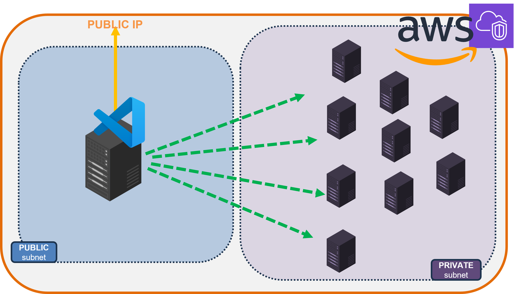
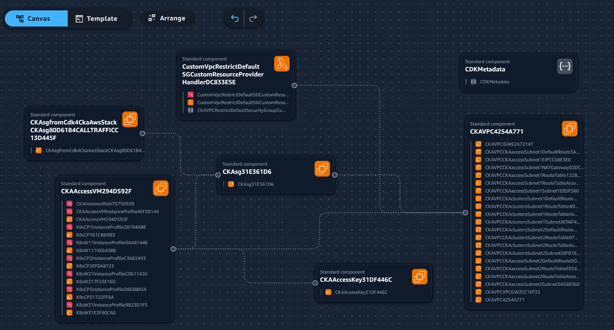

# **CKA(D) on AWS Lab with CDK**
This repository contains an AWS CDK project to create an environment for a class of students practicing for the [Certified Kubernetes Administrator (CKA)](https://training.linuxfoundation.org/certification/certified-kubernetes-administrator-cka) or [Certified Kubernetes Application Developer (CKAD)](https://training.linuxfoundation.org/certification/certified-kubernetes-application-developer-ckad) exams on AWS.  

## **Infrastructure**
The project will create:  
- One *Control Plane Node* for each student  
- A given number of *Worker Nodes* for each student  
- A Bastion host machine with [`code-server`](https://github.com/coder/code-server) running on top (one instance for each student) to interact with clusters  



## **Prerequisites**
To use this project, you'll need to configure:
- **awscli** --> [installation instructions](https://docs.aws.amazon.com/cli/latest/userguide/getting-started-install.html)  
   Once installed, configure the awscli:
  ```bash
  $ aws configure
  ```
  **_Administrator_** rights are required to bootstrap the infrastructure.

- **cdk**  
   To install CDK, you should have _npm_ and _node.js_ **v12+**.  
   Then install it with:
  ```bash
  $ npm install -g aws-cdk
  ```

## **Bootstrap Resources**
Before creating the infrastructure, the project must be bootstrapped to prepare resources.

1. Customize your Stack **by modifying variables in the [`.env`](./.env) file**
- *ACCESS_NUM* - Number of access users. One editor access per user will be created. 1 by default
- *CLUSTERS_NUM* - Number of clusters. Same as access users by default
- *WORKERS_NUM* - Number of worker nodes per cluster. 1 by default
- *K8S_VERSION* - The Kubernetes version. 1.33 by default
- *ACCESS_PSW* - The password access users will use to connect to code-server

2. Dependencies preparation.  
   From the root directory of the project, run the command:

   ```bash
   $ npm install
   ```

3. **_cdk_** preparation.  
   To allow cdk to create resources on your account, the utility must be initialized.  
   From the root directory of the project, run the command:
   ```bash
   $ cdk bootstrap
   ```
   Ensure your _awscli_ is configured with administrator rights for this command to succeed.

4. **(Optional)**. To explore what you're going to create, it's possible to generate the relative **[Cloud Formation](https://aws.amazon.com/cloudformation)** stack file with:
   ```bash
   $ cdk synth > cf-template.yaml
   ```  
   This file can be pasted into tools like **[Infrastructure Composer](https://aws.amazon.com/infrastructure-composer)** for a visual description

   

4. **_cdk_** deploy.  
   To actually create the _CloudFormation_ Stack with the desired resources:
   ```bash
   $ cdk deploy --all
   ```
   ⚠️**NOTE**⚠️  
   *This command will start creating resources and using your billing/credits.*

## **Nodes Descriptions**
All nodes can be accessed with the same ssh key generated on startup.
- ### K8s Nodes  
    Both *Control Plane* nodes and *Worker* nodes share the same configuration:
    - user: **ubuntu**
    - OS: Ubuntu 24.04
    - Instance type: t3.medium (x86)
    - Storage size: 20G
    - Relevant installed tools:
        - `AWS System Manager`
        - `containerd`
        - `kubectl`
        - `kubeadm`
        - `cilium`
- ### **Access Node**
    *Access* node configuration:
    - user: 
        - **ec2-user** if accessing with ssh
        - **user\<X\>** if accessing from code-server UI (where **X** goes from 1 to the number of `USERS`)
    - OS: Amazon Linux
    - Instance Type: m8g.xlarge4
    - Storage size: 8G
    - Relevant installed tools:
        - `AWS System Manager`
        - `docker`
        - `aws-cli`
        - `kubectl`
        - `helm`
        - `git`
        - `code-server`

## **Usage Walkthrough**
Follow the [detailed walkthrough](./docs/walkthrough.md)

## **Night Stop**
To save money, it's possible to stop all nodes with the [stop-instances](./utils/stop-instances.sh) script:
```bash
$ ./utils/stop-instances.sh
```
OR with PS
```powershell
PS> .\utils\stop-instances.ps1
```

When you need them back, you can restart them with the [start-instances](./utils/start-instances.sh) script:
```bash
$ ./utils/start-instances.sh
```
OR with PS
```powershell
PS> .\utils\start-instances.ps1
```

## **Clean up**
You can destroy AWS LoadBalancers and EBS volumes created by K8s with the [`cleanup`](./utils/cleanup.sh) script:
```bash
$ ./utils/cleanup.sh
```
OR with PS
```powershell
PS> .\utils\cleanup.ps1
```

Finally, to destroy all created resources, run the command:
```bash
cdk destroy 
```
And wait for confirmation