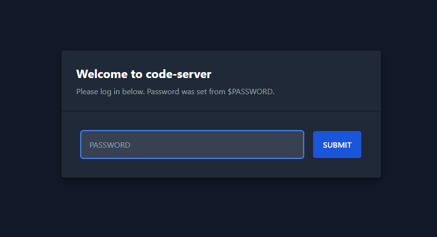
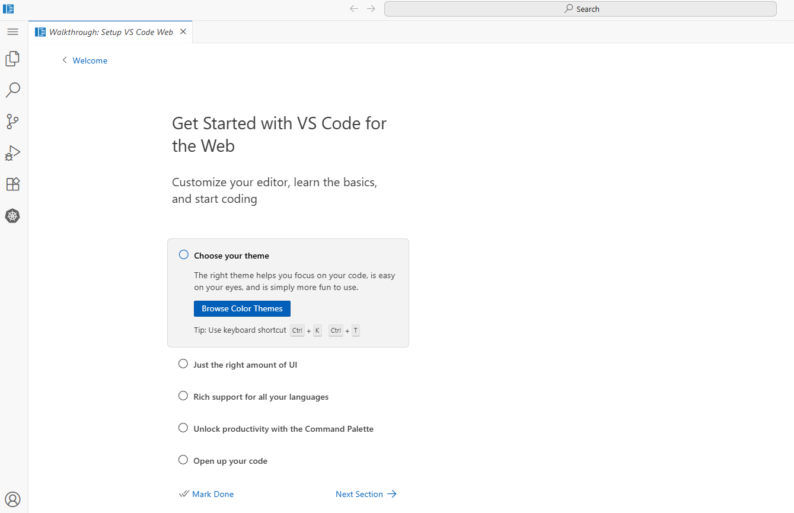

# **Detailed Walkthrough**
This walkthrough will guide you on how to access and configure clusters.

## 0 - Gather Infrastructure Info
- <u>Access Node public IP</u>  
   Once the CDK deployment is completed, the *Access* node public IP is printed.  
   This can also be gathered with the [`get-access-ip`](../utils/get-access-ip.sh) script:
   ```bash
   $ ./utils/get-access-ip.sh
   ```
   OR with PowerShell:
   ```powershell
   PS> .\utils\get-access-ip.ps1
   ```

- <u>VMs details</u>  
  The script [`generate-k8s-instances-csv`](../utils/generate-k8s-instances-csv.sh) generates a CSV file containing details of K8s VMs (useful for tagging K8s nodes later). It also uploads the file to the *Access* node in the `/public` folder:
   ```bash
   $ ./utils/generate-k8s-instances-csv.sh
   ```
   OR with PowerShell:
   ```powershell
   PS> .\utils\generate-k8s-instances-csv.ps1
   ```

- <u>VMs SSH</u>  
  All VMs (both *Access* and K8s nodes) share the same SSH key. This can be retrieved with the [`get-ssh-key`](../utils/get-ssh-key.sh) script:
   ```bash
   $ ./utils/get-ssh-key.sh
   ```
   OR with PowerShell:
   ```powershell
   PS> .\utils\get-ssh-key.ps1
   ```
   The script generates a `key.pem` file, enabling you to log in to the *Access* node with:
   ```bash
   ssh -i key.pem ec2-user@$PUBLIC_IP
   ```

## 1 - Access the Bastion Host (Access Node)
From the *Access* node public IP, you can log in to the exposed code-server via `https://<PUBLIC_IP>:8080 + <USER_NUM>`.  
**Example**
- user1 --> `https://<PUBLIC_IP>:8081`
- user2 --> `https://<PUBLIC_IP>:8082`
- ... 

**Note.** The certicate is self-signed so it will give you a security warning when opening the page.  
Safely proceed



The password to log in is defined by the `ACCESS_PSW` variable (**lab123** by default).



**NOTE.** The **[Kubernetes Extension](https://marketplace.visualstudio.com/items?itemName=ms-kubernetes-tools.vscode-kubernetes-tools)** has already been installed to simplify coding.  
**NOTE 2.** The `/public` folder of the *Access* node can be read/written by any user.  
This is useful for sharing files in the code-server.

## 2 - Create the Kubernetes Cluster
Every user must create their own cluster from their code-server access.
- **Clusters Details**
    In the `/public` folder on the *Access VM* there are 2 files
    - `user-instances.csv` -> a CSV file containing an association between **users** and their assigned **K8s VMs** (control planes and workers)
    - `k8s-instances.csv` -> a CSV file containing details of K8s VMs (useful for tagging K8s nodes later)
- **CP Login**  
    Referring to the `user-instances.csv` file, each user should connect to their *Control Plane* machine from the *Access* node.  
    The SSH key has been pre-generated and can be found in every user's home folder as `k8s-key`:
    ```bash
    ssh -i $HOME/k8s-key ubuntu@<CP_IP>
    ```

- **K8s init**  
    To initialize the *Control Plane*, use `kubeadm`:
    ```bash
    # FROM THE CONTROL PLANE MACHINE #
    sudo kubeadm init --pod-network-cidr 172.16.0.0/16
    ```
    At the end of the process, a command to join worker nodes will be printed. Save it for later.

    Do not forget to configure the `kubectl` utility as suggested in the output:
    ```bash
    # FROM THE CONTROL PLANE MACHINE #
    mkdir -p $HOME/.kube
    sudo cp -i /etc/kubernetes/admin.conf $HOME/.kube/config
    sudo chown $(id -u):$(id -g) $HOME/.kube/config
    ```

- **CNI Installation**  
    To have a working K8s cluster, a **CNI** must be added.  
    Although you can install any CNI of your choice, *Control Plane* machines come with **[`cilium`](https://cilium.io)** pre-installed.  
    If you want to use **cilium** as the CNI, install it on the newly created cluster with:
    ```bash
    # FROM THE CONTROL PLANE MACHINE #
    CILIUM_VERSION=1.18.3 # Check for most recent version
    cilium install --version $CILIUM_VERSION \
                   --set ipam.mode=kubernetes
    ```

- **Worker Login & Join**  
    Referring to the `user-instances.csv` file, each user should connect to their *Worker(s)* machine from the *Access* node.  
    The SSH key is again `k8s-key`:
    ```bash
    ssh -i $HOME/k8s-key ubuntu@<W_IP>
    ```
    To join the cluster, run the command previously saved from the *Control Plane* machine with `sudo`:
    ```bash
    # FROM WORKER(S) MACHINE(S) #
    sudo kubeadm join <CP_IP>:6443 --token <TOKEN> \
        --discovery-token-ca-cert-hash  <CA_CERT_HASH>
    ```
    If the join command is lost, it can be regenerated from the *Control Plane* with:
    ```bash
    # FROM THE CONTROL PLANE MACHINE #
    sudo kubeadm token create --print-join-command
    ```

- **Configure Access Node User Kubeconfig**  
    Once clusters are up and running, each user must copy the **kubeconfig** file from the *Control Plane* node to their home folder in the *Access* node:
    ```bash
    mkdir -p $HOME/.kube
    scp -i k8s-key ubuntu@<CP_IP>:/home/ubuntu/.kube/config $HOME/.kube/config
    ``` 

- **Cluster READY**  
    Now it's possible to manage the cluster from the *Access* node. Try:
    ```bash
    kubectl get nodes
    ```
    **NOTE.** Alias `k` for `kubectl` and bash autocompletion have already been installed for all access users


## (Optional) Ansible
The *Access* node has pre-installed and pre-configured **ansible**.  
- With `ansible cps` is possible to communicate with all control planes.  
- With `ansible workers` is possible to communicate with all control planes. 
Try with  
```bash
ansible all -m ping
ansible cps -m ping
ansible workers -m ping
```

# **Cluster Addons**
## **Metric Server**
The **[Metric Server](https://github.com/kubernetes-sigs/metrics-server)** can be added with `Helm` from the *Access* node with
```bash
helm repo add metrics-server https://kubernetes-sigs.github.io/metrics-server/

helm install metric-server metrics-server/metrics-server -n kube-system --set "args={--kubelet-insecure-tls,--metric-resolution=40s}"
```

## **Load Balancer**
**⚠️NOT CKA ALERT⚠️** This topic, although a very important element in Kubernetes in not covered by CKA. If you're training for CKA certification ONLY you can skip this step.  

As the environment lives on AWS, it's possible to implement the **[AWS Load Balancer Controller](https://kubernetes-sigs.github.io/aws-load-balancer-controller/latest)**

- **Node Labels**  
    For AWS plugin to work nodes must have some metadata configured.  
    This information are listed in the `k8s-instances.csv` file.  
    Once all clusters are ready it's possible to patch all nodes using the script [`/public/aws-node-patch.sh`](../access-helpers/aws-node-patch.sh)
    ```bash
    # FROM ACCESS VM
    $ /public/aws-node-patch.sh
    ```

    This will add region, zone and machine type to k8s node as labels and will configure the EC2 machine id as `Provider` of the node.

- **Add the LB Controller**
    The LoadBalancer controller can be add using `Helm` from the *Access* node with
    ```bash
    helm repo add eks https://aws.github.io/eks-charts
    helm install aws-load-balancer-controller eks/aws-load-balancer-controller -n kube-system --set clusterName=kubernetes
    ```

    **Note.** The required IAM policy has already been added to each EC2 role

## **Ingress & Gateway API**
**⚠️NOT CKA ALERT⚠️** This topic, although a very important element in Kubernetes in not covered by CKA. If you're training for CKA certification ONLY you can skip this step. 

Although you can decide the approach you prefer for Ingress and GW API controller here **cilium** is used.

- **Update Cilium**  
    In order to make **cilium** manage Ingress and Gateway requests it must be reconfigured.  
    This must be done from *Control Plane* node where cilium is installed
    ```bash
    # FROM THE CONTROL PLANE MACHINE #
    cilium upgrade --reuse-values \
                   --set kubeProxyReplacement=true \
                   --set ingressController.enabled=true \
                   --set ingressController.loadbalancerMode=dedicated \
                   --set ingressController.default=true \
                   --set gatewayAPI.enabled=true
    ```

    After that cilium pods must be restarted (can be done from *Access* node or *Control Plane*)
    ```bash
    kubectl -n kube-system rollout restart daemonset/cilium
    kubectl -n kube-system rollout restart deployment/cilium-operator
    ```
- **Ingress READY**  
    **Clium** will automatically create an *IngressClass* and set it as default, so it's already possible to create Ingress resources who will be bound to the AWS LoadBalancer.  
    
    **Note.** By default created AWS LoadBalancers will **internal** facing. So they'll be reachable from **Access** node but not from public Internet.  
    You should modify the [LB service annotation](https://kubernetes-sigs.github.io/aws-load-balancer-controller/v2.2/guide/service/annotations) for change this behaviour

- **Gateway API**
    First of all Gateway CRDs must be added
    ```bash
    export GWAPI_VERSION=1.4.0
    kubectl apply -f https://github.com/kubernetes-sigs/gateway-api/releases/download/v${GWAPI_VERSION}/standard-install.yaml

    ### If you want also experimental
    kubectl apply -f https://github.com/kubernetes-sigs/gateway-api/releases/download/v${GWAPI_VERSION}/experimental-install.yaml

    ```

    Now restart Cilium pods once again to make them see new APIs
    ```bash
    kubectl -n kube-system rollout restart daemonset/cilium
    kubectl -n kube-system rollout restart deployment/cilium-operator
    ```

    Now a Gateway Class must be added for cilium
    ```bash
    cat <<EOF | kubectl apply -f -
    apiVersion: gateway.networking.k8s.io/v1
    kind: GatewayClass
    metadata:
      name: cilium
    spec:
      controllerName: io.cilium/gateway-controller
      description: The default Cilium GatewayClass
    
    EOF
    ```
- **Gateway API READY**
    If's possible now create Gateways and Routes resources. The Gateway will be bound to an AWS NLB (like the Ingress)

## **Container Storage Interface**
**⚠️NOT CKA ALERT⚠️** This topic, although a very important element in Kubernetes in not covered by CKA. If you're training for CKA certification ONLY you can skip this step.

As the environment lives on AWS, it's possible to implement the **[EBS CSI Driver](https://github.com/kubernetes-sigs/aws-ebs-csi-driver)** for a persistent Storage Solution

**Note.** This is a block storage solution so it will work only for PVC with `accessMode: ReadWriteOnce`.

It can be installed from the *Access* node with `Helm`
```bash
helm repo add aws-ebs-csi-driver https://kubernetes-sigs.github.io/aws-ebs-csi-driver

helm upgrade --install aws-ebs-csi-driver \
    --namespace kube-system \
    aws-ebs-csi-driver/aws-ebs-csi-driver
```
**Note.** The required IAM policy has already been added to each EC2 role